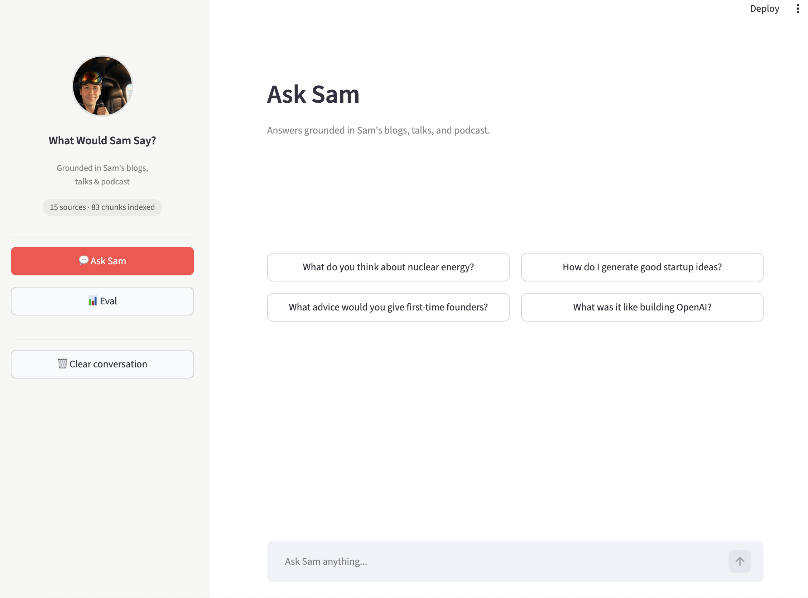
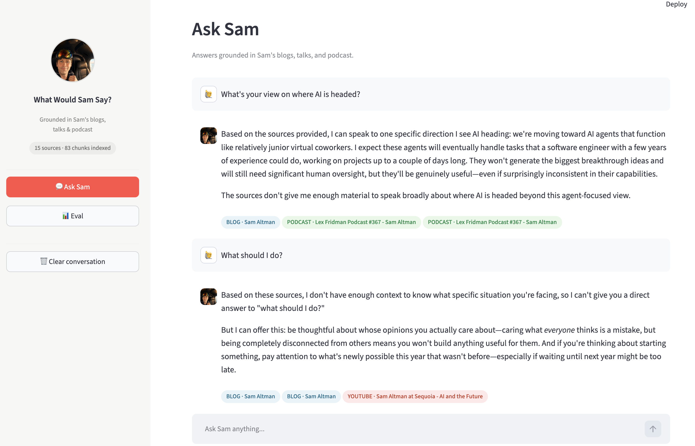
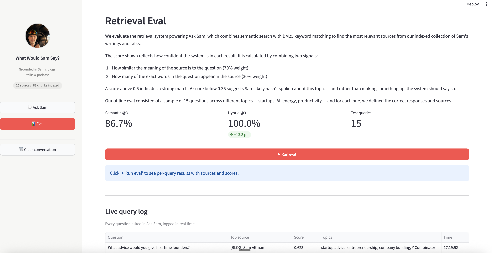

# 🤔 What Would Sam Say?
### (Aka) A Multimodal Content Retrieval System

A RAG (Retrieval Augmented Generation) pipeline that lets you have a conversation 
with Sam Altman — grounded entirely in his own words from blogs, talks, and podcast.

Built as a hands-on exploration of the core problems in modern content retrieval: 
multimodal ingestion, AI-generated metadata enrichment, hybrid search, and 
retrieval quality evaluation.

---

## 🎯 Why I Built This

Content retrieval is the foundational layer of any AI product. If the wrong content 
gets retrieved, the answer will be wrong — regardless of how good the language model 
is. I built this project to understand that problem hands-on: what does it take to 
ingest diverse content types, enrich them with meaningful metadata, and retrieve the 
right source reliably across different query types?

The architecture mirrors real-world content retrieval challenges: a corpus of mixed 
media (text, video, audio), AI-generated metadata that requires human review before 
indexing, hybrid search that balances meaning with exact keyword matching, and an 
eval harness that measures whether retrieval is actually working.

## 📸 Screenshots

**Ask Sam**



**Retrieval Eval**


---

## 🏗️ Architecture
Ingestion → Enrichment → Indexing → Retrieval → Generation

### 📥 1. Ingestion layer
Three content types ingested and normalized into a single corpus schema:
- 📝 **Blog posts** — scraped from blog.samaltman.com (11 posts)
- 🎥 **YouTube transcripts** — pulled via youtube-transcript-api (3 talks)
- 🎙️ **Podcast** — downloaded and transcribed via Whisper (1 episode, ~45 mins)

Every document is normalized to the same base schema regardless of source type:
`doc_id`, `title`, `date`, `url`, `source_type`, `content`

### ✨ 2. Enrichment layer
Each document is enriched with AI-generated metadata via the Anthropic API:
- 🏷️ **Topics** — 3-5 key themes
- 👤 **Entities** — key people, companies, concepts
- 📋 **Summary** — one sentence

Critically, enriched metadata passes through an **editor-in-the-loop review step** 
before indexing — approve, edit, or reject each document's metadata. This mirrors 
production content pipelines where AI-generated metadata requires human validation 
before it becomes trusted signal.

### 🗄️ 3. Indexing layer
- Documents chunked into 500-word segments with 50-word overlap
- Each chunk embedded using `sentence-transformers` (all-MiniLM-L6-v2)
- Chunks stored in ChromaDB with embeddings + metadata persisted on disk

### 🔍 4. Retrieval layer
Hybrid search blending two signals:
- 🧠 **Semantic search (70%)** — vector similarity via ChromaDB
- 🔤 **BM25 keyword search (30%)** — exact term matching via rank-bm25

The hybrid approach outperforms pure semantic search on proper noun queries 
(named people, companies, events) where exact keyword matching matters.

### 💬 5. Generation layer
Retrieved chunks are passed as grounded context to Claude, which generates 
answers in Sam's voice. The system is instructed to acknowledge when the corpus 
doesn't contain enough information rather than hallucinate.

---

## 📊 Eval Results

We evaluate across two dimensions:
1. ✅ Has Sam genuinely spoken or written about this topic?
2. ✅ Is the right source surfaced in the top 3 results?

15 test queries across topics — startups, AI, energy, productivity — with known 
correct sources defined in advance.

| Approach | Hit Rate @3 |
|---|---|
| 🔵 Semantic only | 86.7% |
| 🟢 Hybrid (BM25 + semantic) | 100.0% |

The 13.3 point gap appears specifically on proper noun queries — "Helion Energy 
nuclear fusion", "Y Combinator Startup School 2019" — where BM25 keyword matching 
catches what pure semantic search misses.

---

## 🧠 Key Design Decisions

**🔀 Separate ingestion from enrichment**
Ingestion and enrichment fail for different reasons (network vs. model). Keeping 
them as separate pipeline stages means either can be re-run independently without 
touching the other.

**👤 Editor-in-the-loop before indexing**
AI-generated metadata isn't always right. A human review gate before indexing 
ensures only validated metadata enters the index — important in any domain where 
metadata quality affects downstream trust.

**🧩 Chunk-level metadata preservation**
Every chunk retains the metadata of its parent document. This means every retrieved 
result knows its source type, topics, entities, and summary — not just its raw text.

**⚡ Hybrid search over pure semantic**
Pure semantic search struggles with proper nouns and exact terms. Hybrid search 
combining BM25 (30%) with vector similarity (70%) closes that gap without 
sacrificing conceptual retrieval quality.

**🧪 Eval harness built in**
Retrieval quality is measured, not assumed. The eval tab in the UI runs the full 
test suite and shows per-query results with sources and scores — making quality 
visible and monitorable.

---

## ⚠️ Known Limitations

- 📛 **Blog titles not unique** — the scraper pulls generic "Sam Altman" as the title 
for some posts. In production, a metadata schema would enforce unique human-readable 
titles at ingestion.
- 📉 **No score threshold enforcement** — the system returns results even for low 
confidence scores. A production system would return "I don't have enough context" 
below a defined threshold.
- ⏰ **No freshness handling** — the corpus is static. A production retrieval system 
needs an ingestion pipeline that handles new content and re-indexes incrementally.
- 📋 **Eval ground truth is manual** — the 15 test queries and correct sources were 
defined by hand. At scale, ground truth curation needs its own workflow.
- 🗄️ **Prototype vector DB** — ChromaDB works well at this scale. At NYT-scale query 
volume, this would require evaluation of production vector databases (Pinecone, 
turbopuffer, pgvector) across latency, cost, and hybrid search support.

---

## 🛠️ Stack

| Tool | Purpose |
|---|---|
| 🤖 Anthropic API | Metadata enrichment + answer generation |
| 🗄️ ChromaDB | Vector storage and semantic search |
| 🔢 sentence-transformers | Embedding model (all-MiniLM-L6-v2) |
| 🔤 rank-bm25 | Keyword search |
| 🎙️ faster-whisper | Podcast transcription |
| 🎥 youtube-transcript-api | YouTube transcript ingestion |
| 🌐 Streamlit | UI |
| 🐍 Python 3.12 | Language |

---

## 🚀 Setup

```bash
git clone https://github.com/aarushirai234/what-would-sam-say
cd what-would-sam-say
python3.12 -m venv venv
source venv/bin/activate
pip install -r requirements.txt
```

Add your Anthropic API key to `.env`:

```bash
ANTHROPIC_API_KEY=your_api_key_here
```

The Streamlit app and the metadata enrichment step both use the Anthropic Python
SDK, which reads `ANTHROPIC_API_KEY` from the environment after `load_dotenv()`.

### Build the local index

`data/chroma_db/` is intentionally ignored by git, so a fresh clone needs a local
index before retrieval, evals, or the app can run:

```bash
python indexing/index.py
```

This reads `data/enriched_corpus.json`, chunks every approved document into
500-word windows with 50-word overlap, embeds each chunk with
`all-MiniLM-L6-v2`, and recreates the Chroma collection named `sam_docs`.

### Run the app

```bash
streamlit run app.py
```

The app has two sidebar modes:
- **Ask Sam** retrieves the top 3 hybrid-search chunks, sends them to Claude as
  grounded context, and renders source bubbles for the answer.
- **Eval** runs the 15-query retrieval test set from `evals/eval.py` and
  compares semantic-only retrieval against hybrid retrieval.

You can also use the terminal interface:

```bash
python retrieval/ask.py
```

## 🔁 Data pipeline runbook

The checked-in JSON files under `data/` are enough to rebuild the local Chroma
index. Re-run earlier stages only when changing the source corpus or metadata.

| Stage | Command | Reads | Writes | Notes |
|---|---|---|---|---|
| Blog ingestion | `python ingestion/scrape_blogs.py` | `POSTS` in the script | `data/blogs.json` | Scrapes the configured `blog.samaltman.com` slugs and sleeps 1 second between requests. |
| YouTube ingestion | `python ingestion/fetch_transcripts.py` | `VIDEOS` in the script | `data/transcripts.json` | Uses `youtube-transcript-api`; videos without available transcripts are skipped with a printed error. |
| Podcast transcription | `python ingestion/transcribe_podcast.py` | `data/podcast.mp3` | `data/podcast.json` | Requires a local MP3 file that is gitignored; transcribes on CPU with faster-whisper `base`. |
| Combine corpus | `python ingestion/combine_corpus.py` | `data/blogs.json`, `data/transcripts.json`, `data/podcast.json` | `data/corpus.json` | Adds sequential `doc_id` values (`doc_000`, `doc_001`, ...). |
| Metadata enrichment | `python enrichment/enrich.py` | `data/corpus.json`, `.env` | `data/enriched_corpus.json` | Calls Claude for topics, entities, and summary; each document must be approved, edited, or rejected interactively. |
| Indexing | `python indexing/index.py` | `data/enriched_corpus.json` | `data/chroma_db/` | Deletes and recreates the `sam_docs` Chroma collection each run. |

Recommended rebuild sequence after changing source content:

```bash
python ingestion/scrape_blogs.py
python ingestion/fetch_transcripts.py
# Optional: only if you have data/podcast.mp3 locally
python ingestion/transcribe_podcast.py
python ingestion/combine_corpus.py
python enrichment/enrich.py
python indexing/index.py
```

## 🧪 Verification commands

```bash
# Compare semantic search and hybrid search against the 15-query eval set.
python evals/eval.py

# Inspect the retrieval behavior on a proper-noun query where BM25 helps.
python retrieval/search.py
```

Both commands require `data/chroma_db/` to exist. If Chroma raises a missing
collection error for `sam_docs`, run `python indexing/index.py` first.

## 🧯 Troubleshooting

- **`ANTHROPIC_API_KEY` errors**: confirm `.env` exists at the repo root and the
  virtual environment is active before running `app.py`, `retrieval/ask.py`, or
  `enrichment/enrich.py`.
- **Missing Chroma collection**: `retrieval/search.py` loads `data/chroma_db`
  during import and expects a collection named `sam_docs`; rebuild with
  `python indexing/index.py`.
- **Slow first run**: `sentence-transformers` and faster-whisper may download
  local model files the first time they are used.
- **Podcast rebuild fails**: `data/podcast.mp3` is not committed. Place the MP3
  at that path before running `ingestion/transcribe_podcast.py`, or keep the
  checked-in `data/podcast.json`.
